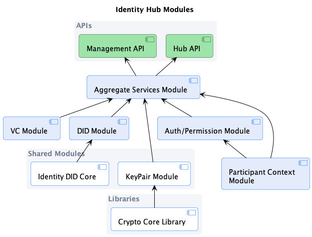

# Modules and services of the IdentityHub

## VC Module (`:core:lib:verifiable-presentations-lib`)

Contains the `VerifiablePresentationService` implementation. 
Its job is to

- generate and serve VPs (through the [Hub API](#hub-api))
- CRUD VCs, for example when the Issuer wants to write a VC via the [Hub API](#identity-api) or
  the [Identity API](#identity-api)
- run the `VerifiableCredentialManager`
- exchanges protocol messages with the Issuer, e.g. in response to a credential-offer

`VerifiableCredentialManager`: it can be configured whether credentials are auto-renewed (default is `true`). Once a
renewal is triggered , it moves into the `REISSUE_REQUESTING` state. Generally, renewals can be triggered by three
events:

1. an incoming credential offer
2. the state machine detects a nearing expiry (if auto-renewal is active)
3. a manual action via the Identity API

## DID Module (`:core:identity-hub-did`)

Contains the `DidDocumentService` implementation. Its job is to

- create/read/update(/delete) DID resources in the `DidResourceStore`
- publish/overwrite DID documents using the publishers
- react to key rotation events from the [KeyPair module](#keypair-module): adds new keys to the DID, removes old ones,
  etc.
- react to manual action via the Identity API

## KeyPair Module (`:core:identity-hub-keypairs`)

Contains the `KeyPairService` implementation. Its job is to

- generate and maintain key pairs using a state machine
- check for automatic renewal, e.g. if keys are configured with a max lifetime
- send out events when a key is rotated
- react to manual action via the Identity API

## Auth/Permission Modules (`:core:lib`)

Parses and validates tokens created by the STS:

- verify the signature of the token using the STS's public key
- the IH must have a way to obtain the public key, which corresponds to the private key which was used by the STS
  to sign the token: STS public key could be a config value, or it could be resolved through a DID or a plain URL. If
  both STS and the IH are embedded in the connector, it could even short-circuit, and simply load the `KeyPairResource`.
  from storage. This must be abstracted out through a resolver or similar.
- compares the request (=query) with the scopes in the token to see if it matches
- validate other claims (`sub`, `aud`, `iss`, `jti`, `iat`...) depending on the implementation of the
  proof-of-original-possession.

## Aggregate Services Module

Handles transactions and combines the results of various lower-level services

## Participant Context Module (`:core:identity-hub-participants`)

Contains the `ParticipantContextStore`, CRUDs participant entries. Mutating requests are only allowed for the
super-user (i.e. a technical user for some onboarding portal). The client only has read-access to its participant
context.

Participant contexts are always identified by the participant ID.

Clients must know their participant context, because they need to supply their participant-ID (BPN) with every request
against the Hub's APIs.

## SPI Module

all SPIs that are relevant here.

## Hub API (`:core:presentation-api`)

This module contains implementations for
the [Presentation API](https://github.com/eclipse-tractusx/identity-trust/blob/main/specifications/M1/verifiable.presentation.protocol.md#4-resolution-api)
and
the [Storage API](https://github.com/eclipse-tractusx/identity-trust/blob/main/specifications/M1/verifiable.presentation.protocol.md#5-storage-api).
Is
contains model classes, validators and JSON-LD-transformers.

## Identity API (`:extensions:api:identity-api`)

This module contains implementations to maintain internal data structures, such as:

- key pairs: get, rotate, revoke, set default (Caution: handling private keys through an API is DANGEROUS!)
- DID documents: get, publish, un-publish
- Credentials: create, read, update, delete, renew
- Participant Context: read. Create/Delete/Update requires elevated permissions!

## Not in the IdentityHub repo

modules to verify and validate VerifiableCredentials and VerifiablePresentations