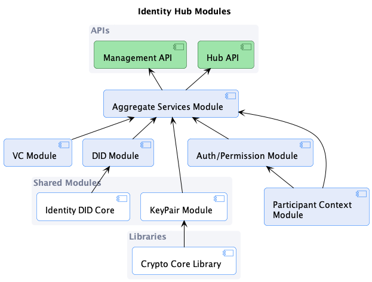

# 1. Introduction

An `Identity Hub` (IH) manages identity resources in a dataspace. Specifically, it provides two services:

- **Credential Service (CS)**. The CS manages [Verifiable Credentials](https://www.w3.org/TR/vc-data-model/).
  This includes read and write endpoints for Verifiable Presentations (VPs) and Verifiable Credentials (VCs).
- **DID Service (DIDS)**. The DIDS is responsible for the creation, management and resolution of participant DIDs.

## 1.2. EDC Foundation

The Identity Hub is built using the EDC modularity and extensibility system. It also relies on core EDC components such
as cryptographic primitives, Json-Ld processing, and DID resolution.

The EDC modularity and extensibility system supports flexible deployment topologies where the Identity Hub services can
be collocated in the same process or distributed across different clusters. For example, it is possible to deploy all
three IH services (STS, CS, and DIDS) as a single unit, or separate them into individually managed services.

## 1.3. Deployment Topologies

Two deployment topologies will be supported:

1. **Embedded**: The Identity Hub can be embedded in an EDC control-plane runtime
2. **Standalone**: The Identity Hub can be deployed as a single or clustered standalone runtime

## 1.4. Key Use Cases

1. Initiate and manage a credential request
2. Serve VPs
3. Monitor and manage re-issuance
4. Manage DIDs, DID document resources, and DID document publication

# 2. Architecture Concepts

## 2.1. The Participant Context

A participant context (PC) functions as a unit of management and control for `identity resources` in the Identity Hub.
All resources are contained and accessed through a PC. Contexts are tied to the participant identity as defined in
the [DSP specifications](https://github.com/International-Data-Spaces-Association/ids-specification) and created through
the [Identity API](#311-elevated-privilege-operations).

Access control for public client API endpoints is scoped to a specific PC. For example, an access token as defined in
the [Base Identity Protocol specification]() is associated with a specific context and may not be used to access
resources in another context.

The lifecycle of identity resources is bound to their containing context; if a PC is removed, this operation will
cascade to all contained resources.

Services may register to receive participant context events, for example, when a context is created or deleted.

## 2.2. Identity Resources

An `identity resource` can be an `attestation`, `cryptographic material`, or an `identifier` associated with a dataspace
participant. A `Verifiable Credential` (VC), `DID`, and `DID Document` are identity resources.

### 2.2.1. Verifiable Credential Resources

A `VerifiableCredentialResource` (VCR) is a type of `identity resource` and will be stored on the holder side:

```java
class VerifiableCredentialResource implements IdentityResource {
    String id;
    long timestamp;
    VcState state;
    String issuerId;
    String holderId;
    Policy issuancePolicy;
    Policy reissuancePolicy;
    VerifiableCredential verifiableCredential;
}
```

The `issuerId` is a `URN`, typically a DID, that can be resolved to return the service endpoint of the Credential
Issuer.

The `issuancePolicy` and `reissuancePolicy` fields are `ODRL` policies provided by the Credential Issuer according to
the VPP specification. They are used to determine which VCs or other prerequisites are needed to initiate a flow.

The `state` and `timestamp` fields are used to determine when the resource entered a particular state, for example, when
the resource was requested.

Credential states are defined as follows:

```java
enum VcState {
    INITIAL, REQUESTING, REQUESTED, ISSUING, ISSUED, REISSUE_REQUESTING, REISSUE_REQUESTED, TERMINATED, ERROR
}
```

There are three areas in which a `VerifiableCredentialResource` will be used:

1. _on the holder side_: the older manages credentials and uses them in verifiable presentations
2. _on the issuer side_, to track issued credentials. The issuer must keep track of which credentials were issued to
   which
   holder. In this case, the signed credential **must not be stored** by the issuer.
3. _on the issuer side_, to manage revocation credentials. Issuers must resolve a revocation list credential. In this
   case, metadata about the credential, in particular the `credentialSubject` (containing the bit string) **must not be
   stored** by the issuer.

#### 2.2.1.1 The VerifiableCredentialManager

The `VerifiableCredentialManager` (VCM) manages `VerifiableCredentialResources` across participant contexts. For
example, it monitors outstanding requests and initiates reissue flows. The VCM is cluster-aware and guarantees that only
one flow is in effect for a particular VCR across all runtime instances.

Services may register to receive `VerifiableCredentialManager` events, for example, when a flow is initiated.

### 2.2.3. KeyPair Resources

A `KeyPairResource` is a type of `identity resource` that manages public/private key pairs:

```java
class KeyPairResource {
    String id;
    String groupName;
    String name;
    KeyPairState state;
    long timestamp;
    boolean defaultPair;
    long useDuration;
    long rotationDuration;
    PublicKey publicKey;
    String privateKeyId;
}
```

> Note this resource will also be used by the `Issuer Service`.

The `id` must be a unique to all instances of a participant context and ideally should be a GUID.

The `groupName` identifies which group the key pair belongs to. Other services can be configured with a group to
indicate which key pair to use when signing proofs. Only one `KeyPairResource` should be active for a group.
Inactive `KeyPairResource` are rotated or revoked.

The `name` property is a user-friendly name for the pair.

The `defaultPair` property is set to true if the key pair should be used to sign resources when a specific kay pair is
not specified.

The `useDuration` specifies how long in milliseconds the key pair should be in the `ACTIVATED` state before a rotation
is started. If `-1`, the duration is indefinite and a rotation must be manually triggered.

The `rotationDuration` specifies how long in milliseconds the key pair should be in the `ROTATED` state before a
revocation is started. If `-1`, the duration is indefinite and a revocation must be manually triggered.

KeyPair states are defined as follows:

```java
enum KeyPairState {
    INITIAL, ACTIVATED, ROTATED, REVOKED, ERROR
}
```

#### 2.2.3.1. The KeyPairManager

The `KeyPairManager` (KPM) manages `KeyPairResources` across participant contexts. For example, it monitors when keys
need to be rotated and revoked. The KPM is cluster-aware and guarantees that only one flow is in effect for a
particular `KeyPairResource` across all runtime instances.

Services may register to receive `KeyPairManager` events, for example, when a rotation or revocation is initiated.

### 2.2.4. DID Resources

A `DIDResource` is a `DID` and associated entries in a `DID` document. It represents the lifecycle of a DID Document in
the IdentityHub.

```java
class DidResource {
    String did;
    DidState state;
    long stateTimestamp;
    long createTimestamp;
    DidDocument document;
}

class VerificationRelationship {
    RelationshipType type;
    List<String> methods;
}
```

The `DidDocument` is defined in the connector repository and is a representation of
a [W3C DID](https://www.w3.org/TR/did-core/).

> NB: There is no DID manager.

### 2.2.5. DID Publisher

The `DidPublisher` is responsible for taking a `DidResource,` generating a W3C-compliant `DID Document`, and publishing
it to a `Verifiable Data Registry` (VDR). For example, an implementation may publish to a CDN. The `DidPublisher` is
also responsible for un-publishing `DID Documents,` for example, when a participant context is removed.

> We need to create a publisher that is cluster-aware and performant as an `out-of-the-box` option. One solution would
> be to publish to a database and have local caches on each runtime that periodically refresh an in-memory version.

## 2.3. Verifiable Presentation Generation

When a VP is requested, a `VerifiablePresentation` is created from a VC by the `VerifiablePresentationGenerator`. The
generator is responsible for assembling the VP (potentially from multiple VCs) and creating a proof.

> **TODO** Figure out how to select proof types and potentially delegate to a `ProofGenerator`

> **TODO** Investigate how the generator could take DIF Presentation Exchange to generate the VP

## 2.4. Authorization

### 2.4.1. Security Token Service

The Security Token Service is and `IdentityService` implementation responsible for creating self-issued tokens per
the [Base Identity Protocol]().

When creating a self-issued token, The STS will support the creation of a `VP Access Token` using the scope scheme
specified in the [Base Identity Protocol]](). Access tokens are always scoped to a participant context.

### 2.4.2. Authorization Service

The `AuthorizationService` authorizes read and write requests for credential resources. It is built on the policy
engine.

`AccessDefinitions` specify an access policy for a group of resources, identified by a `ResourceType`.
Multiple `AccessDefinitions` may select the same resource; in this case, all `AccessDefinition` policies must be
satisfied to obtain access to the resource. If no `AccessDefinitions` select a resource, the resource is not accessible
to clients via the read or write API.

```java
public class AccessDefinition {
    List<Criterion> resourcesSelector;
    List<String> operations;
    Policy policy;
}
```  

> TODO should write access have a policy constraint always requires a write token? That can be done with a wildcard
> AccessDefinition which is registered (based on config) at startup.
> Note read access should not since some resources should be public. However, for C-X a read token for most types should
> be required.

## 2.5. Identity APIs

The `Identity API` executes authorized client requests to perform operational tasks against the Identity Hub
installation. Operations fall into two groups: those requiring elevated privileges that affect the installation as a
whole, and those that are scoped to a specific participant context.

> Note that the Identity Hub will not include a Management UI or operator authentication. It is expected that deployment
> environments will provide their own authentication/authorization service for operators that map to one of the two
> operation types and a UI for initiating requests.

# 3. Identity Hub Modules and Services

The following diagram depicts the Identity Hub module dependency graph:

[](./identity.hub.modules.png)

The term `installation` is used to denote an Identity Hub deployment that is operated as a unit. An `installation` may
be a single runtime instance or a cluster of instances.

## 3.1. Identity API

The `Identity API` executes authorized client requests to perform operational tasks against the Identity Hub
installation such as adding or manipulating key pairs, DID documents etc.

### 3.1.1. Elevated Privilege Operations

These operations require `superuser` access and include:

- Create/delete/list participant contexts
- Generate new participant context and authorization key

### 3.1.2. Participant Context Operations

These operations are scoped to a participant context and require an API key:

- Rotate/revoke keys
- Create a DID and DID document
    - Add DID elements (verification method, etc.)
    - Publish DID
- List verifiable credentials
- Delete a verifiable credential by id
- Delete verifiable credentials by type
- Initiate key rotation/revocation

All operations publish events.

## 3.2. Hub API

The `Hub API` is an API for external clients that implements the `Verifiable Presentation Protocol` (VPP) and
the `Credential Issuance Protocol` (CIP). It includes the following operations:

- Write a verifiable credential (VPP)
- Present a verifiable credential as a VP (VPP)
    - (support presentation exchange)
- Resolve a verifiable credential by id or type (VPP)
    - (scope/presentation query) (VPP)
- Receive a credential offer (CIP)

## 3.3. Aggregate Services

Aggregate services perform operations that involve the orchestration of cross-module services.

### 3.3.1 ParticipantService

The `ParticipantService` orchestrates participant context state changes and resources. It performs the following
operations:

#### 3.3.1.1 Initialization

Initializes a context and contained resources based on a `ParticipantManifest`, including:

- Generating key pairs
- Creating a DID and generate document
- Activating the context, including publishing the DID document (optional)
- Sending the result to an async callback destination which can be an endpoint or async servlet response

#### 3.3.1.1 Deactivation

Removes a context and all contained resources, sending the result to an async callback destination which can be an
endpoint or async servlet response.

### 3.3.2 OfferProcessor

The offer processor received a `Credential Offer` (CIP) and performs one of the following actions:

- If a `VC Resouce` exists for the offer (type and issuer), and the resource is configured to auto-renew, the processor
  initiates a re-issue request
- Otherwise, if an offer callback is configured, it calls the callback endpoint. The callback mechanism uses the
  callback infrastructure provided by the EDC.
- Otherwise, it ignores the request

### 3.3.3 KeyService

The `KeyService` provides the following operations.

#### 3.3.3.1. Rotation

Key rotation for a `KeyPairResource` is performed as follows:

- A new `KeyPairResource` is created and associated with the same `groupName` as the `KeyPairResource` being rotated
- The private key of the rotated `KeyPairResource` is destroyed.
- A new verification method is added using the `DidDocumentService`.
- The DID document is (optionally) published. Publication may not be performed if the rotation is performed along with
  revocation (see below).

#### 3.3.3.1. Revocation

Key revocation for a `KeyPairResource` is performed as follows:

- The `KeyPairResource` must be in the ROTATED state and is transitioned to the REVOKED state.
- The `verificationMethod` associated with the revoked `KeyPairResource` is removed using the `DidDocumentService`.
- The DID document is published.

## 3.4. Participant Context

The `Participant Context` module is responsible for managing the lifecycle of participant contexts and their
contained resources. Each context is tied to a `dataspace participant id`.

The module:

- Provides persistent storage for created contexts.
- Generates and stores API access tokens
- Emits context events for the following lifecycle events that other systems can listen for:
    - CREATED
    - ACTIVATED
    - DESTROYED

## 3.5. Verifiable Credential Module

The Verifiable Credential module manages VC resources. All resource operations are scoped to the current participant
context. The module contains the following services.

### 3.5.1.CredentialService

The `CredentialService` is responsible for credentials CRUD operations. It delegates to a `CredentialStore` for
persistence.

All CRUD operations publish events.

### 3.5.2. VerifiablePresentationService

The `VerifiablePresentationService` is responsible for delegating to generators, that generate Verifiable
Presentations (VP) from a (VC).

### 3.5.3. CredentialRequestManager

The `CredentialRequestManager` manages VC resources. It dispatches client requests (via the
EDC `RemoteMessageDispatcher`) using the `Credential Issuance Protocol`. It operates across participant contexts and is
updates resource states. For example, the `CredentialRequestManager` handles VC issuance requests and re-issuance
requests.

> The `CredentialRequestManager` is cluster-aware and will guarantee operations are not duplicated across nodes via
> locking.

The `CredentialRequestManager` will delegate to the EDC `PolicyEngine` to ensure the `issuancePolicy`
and `reissuancePolicy` are evaluated when a self-issued ID token is generated as part of an issuer request.

Request operations publish events.

### 3.5.4. CredentialStore

The `CredentialStore` (de)serializes VC resources from persistent storage.

## 3.6. DID Module

The DID module manages DIDs and DID documents for participant contexts. The DID module may be disabled for a
particular participant context. The DID module makes use of the EDC `Identity DID Core` extension.

### 3.6.1. DidDocumentPublisher

The `DidDocumentPublisher` is responsible for generating, publishing and unpublishing DID documents to
a `Verifiable Data Registry` (VDR) such as a CDN that serves a Web domain. The publisher can transition as follows:

- **Publish**: GENERATED -> PUBLISHED
- **Unpublish**: PUBLISHED -> UNPUBLISHED

All operations publish events.

There can be only one publisher per DID method, and all available publishers are kept in a `DidPublisherRegistry`, which
can be used to contribute publishers via the extension mechanism.

### 3.6.2. DidDocumentService

The `DidDocumentService` returns a **managed** DID document to the requesting client. Note that it _**does not**_
resolve foreign DID documents. Note also this service is intended for internal use. DID resolution should be performed
through specific DID methods that work directly with a VDR.

The `DidDocumentService` uses the `DidResourceStore` internally.

## 3.7. Auth/Permission Module

The `Auth/Permission` module includes services that delegate to the EDC `PolicyEngine` for access control.

## 3.8. Key Pair module

The `Key Pair` module is manages `KeyPairResources.` it does this by using database storage for queryable properties and
a secure vault for sensitive material (private keys). The Key Pair module will be shared with the `Issuer Service`.

## 3.9. Crypto Core Library

The `crypto core library` is part of the core EDC and will be used by Identity Hub services.

## 3.10. Identity DID Core Module

This module is part of the core EDC and will be used by Identity Hub services.


