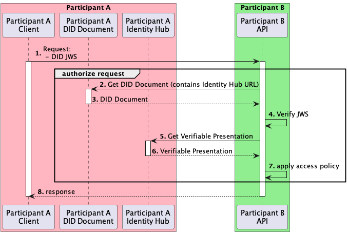
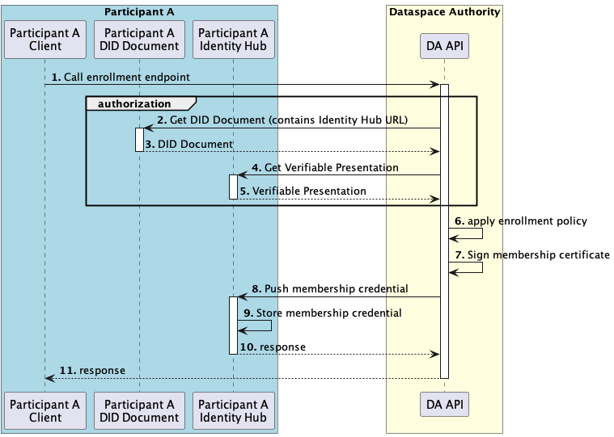

# Identity Hub

An identity hub is a credential storage and message relay system run by a dataspace participant. In particular, the identity hub will be used to securely deliver [Verifiable Credentials](https://www.w3.org/TR/vc-data-model/#what-is-a-verifiable-credential) from a dataspace issuer to a dataspace participant. The hub will also be used to provide [Verifiable Presentations](https://www.w3.org/TR/vc-data-model/#presentations) on behalf of a participant. The Identity Hub will not be used as a message relay system.

This document focuses on what the first version of the Identity Hub will have to enable the MVD (Minimum Viable Dataspace).

## Operations

The Identity Hub will adhere to the [Decentralized Web Node specification](https://identity.foundation/decentralized-web-node/spec/) implementing the following subset of operations.

* [Collections Query](https://identity.foundation/decentralized-web-node/spec/#query) to query Verifiable Presentations
* [Collections Write](https://identity.foundation/decentralized-web-node/spec/#write) to push Verifiable Credentials
* [Feature Detection](https://identity.foundation/decentralized-web-node/spec/#feature-detection) listing the operations above as supported.

The [Verifiable Presentations](https://www.w3.org/TR/vc-data-model/#presentations) returned by the Collections Query operation will be the available Verifiable Credentials. No [derived data](https://www.w3.org/TR/vc-data-model/#presentations) will be extracted from the Verifiable Credentials to generate separate Presentations.

Each participant in the dataspace will have a single [decentralized identifier](https://w3c-ccg.github.io/did-method-web) and a single Identity Hub instance available (no namespacing required). Communication with the Identity Hub will not be subject to authentication or authorization at this time.

## Example Flows

### Participant Authorization

During participant-to-participant communication via IDS REST, the request destination participant queries the Verifiable Presentations of the request originator participant. Access to resources is granted or denied according to the policies in place and the available Verifiable Presentations.

Verifiable Presentations are issued and signed by a trusted authority. Before applying any policies, participants access the public key of that trusted authority from its DID Document, and check that Verifiable Presentations are valid.

Note that complex IDS flows, such as negotiating a contract agreement, requires multiple IDS requests flowing back and forth between participants. In that case, participants will alternate in the flow above, and both participants require an Identity Hub.

### Participant Onboarding

When a participant is successfully onboarded to a dataspace, the dataspace authority pushes a "dataspace membership" Verifiable Credential into the participant's Identity Hub. This Verifiable Credential is then handed over to other participants during the authorization flow, which can enforce dataspace membership as a requirement for communication. 

## Deployment

The Identity Hub will be developed as an EDC extension and will be deployed in a collocated test deployment topology. In this scenario, the Identity Hub and all participant agents (such as IDS Connector and Federated Catalog) run together in a single process. The Identity Hub leverages the EDC runtime to deploy as a set of extensions.

## References

- [Decentralized Web Node](https://identity.foundation/decentralized-web-node/spec/) draft specification
- [Verifiable Credentials](https://www.w3.org/TR/vc-data-model/) W3C recommendation
- [Verifiable Presentations](https://www.w3.org/TR/vc-data-model/#presentations) section of the previous document
- [Web DID](https://w3c-ccg.github.io/did-method-web) draft specification
- Stefan van der Wiele - [Decentralized Identifiers and the Eclipse Dataspace Connector](https://www.youtube.com/watch?v=ic-XEGzdODM) (YouTube video)

