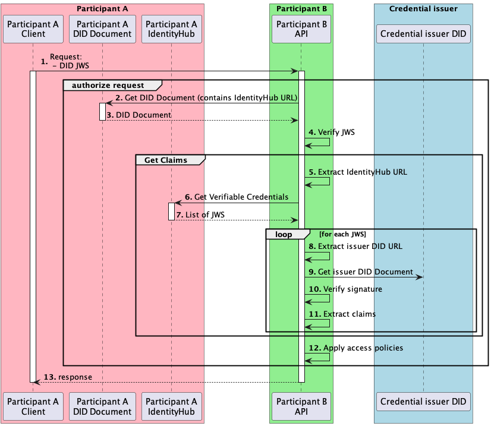

# Identity Hub - Get claims

This document explains how we will get the claims of a participant, in order to apply access policies.

## Context

When an EDC participant receives an IDS request, it must verify the caller's identity and apply access policies for the caller.
To apply policies, it needs to get the claims of the participant.
This document explains the mechanism to get the claims from IdentityHub.

## Claim

A claim is a statement about a subject. For example, a claim could be `ParticipantA` is in `region` `eu`.
See [this documentation](https://www.w3.org/TR/vc-data-model/#claims) for more details.

## Credential issuer

A credential issuer is an entity providing claims about a subject and signing it.
Signing the claim is valuable to make sure the claim is delivered by a trusted entity.

## Examples of policy

In order to apply policy we need to get the claims and verify the issuer of the claim.

### Example 1:

Policy requiring that `Government A` certifies that `Participant A` has `region` `eu`.
In this example, `Government A` is the credential issuer, and the claim is: `Participant A` has `region` `eu`.

### Example 2:

Policy requiring that `Organization A` certifies that `Participant A` has `certification` `ISO 9001`.
In this example, `Organization A` is the credential issuer, and the claim would be `Participant A` has `certification` `ISO 9001`.

## Verifiable Credentials

IdentityHub provides [claims](https://www.w3.org/TR/vc-data-model/#claims) as JWS, signed by a credential issuer, effectively making them verifiable credentials.  

## Get claims

This document focuses on getting the claims of a Participant, assuming the participant's identity is already verified.
The participant will use the claims to apply the access policy.  
Each participant has an IdentityHub instance, exposing an endpoint to get its [Verifiable Credentials](https://www.w3.org/TR/vc-data-model/).
The IdentityHub endpoint returns a list of JWS containing a Verifiable Credential in their payload.
(see [example Verifiable Credential (as JWT)](https://www.w3.org/TR/vc-data-model/#example-usage-of-the-credentialsubject-property)).
The VerifiableCredentials contain [claims](https://www.w3.org/TR/vc-data-model/#claims) that can be extracted.



Let's focus on the `Get claims` box.
`Participant B` wants to get the claims of `Participant A`, to apply access policy.
For example, `Participant B` could have the policy that `Participant A` should be claimed as a `participantOf`
`Dataspace C` by the issuer "gaia-x.com".

5. Participant B extracts the IdentityHub URL of participant A from a DID Document obtained in previous steps.
6. Participant B gets VerifiableCredentials from IdentityHub A.
7. Participant B gets a list of [claims](https://www.w3.org/TR/vc-data-model/#claims) as JWS, signed by a third party, effectively making them [VerifiableCredentials](https://www.w3.org/TR/vc-data-model).  
For each VerifiableCredential:  
   8. Participant B parses the JWS, extracts the issuer DID URL from the JWS payload.  
   9. Participant B retrieves the issuer DID Document.  
   10. From the issuer DID Document, participant B extracts the public key of the issuer and uses it to verify the JWS signature.  
   11. If the signature is successfully verified, it extracts the claims of the participant, each claim needs to be associated with its issuer.  
12. The list of the claims will be used as input to apply the access policies.

## Claims format

The `IdentityHubCredentialsVerifier` returns a `Map<String, Object>`, which contains verifiable credentials with the following format:

```json
"<verifiable-credential-id>": {
  "vc": {
    "id": "<verifiable-credential-id>",
    "credentialSubject": "<claims>"
  }
  "iss": "<issuer did>, (part of the JWT claims)"
  "sub": "<subject>, (part of the JWT claims)"
}
```

The credentialSubject field can contain claims with various format, see the [Credential Subject documentation](https://www.w3.org/TR/vc-data-model/#credential-subject) for more details.

For example:
```json
{
  "vc_id_1": {
    "vc": {
      "id": "vc_id_1",
      "credentialSubject": {
        "region": "eu"
      }, 
       "iss": "did:web:issuer1",
       "sub": "did:web:subjectA"
    }
  },
  "vc_id_2": {
     "vc": {
        "id": "vc_id_2",
        "credentialSubject": {
           "region": "eu"
        },
        "iss": "did:web:issuer2",
        "sub": "did:web:subjectA"
     }
  }
}
```