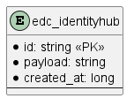

# SQL Identity Hub store

Provides SQL persistence for Identity Hub.

## Prerequisites

Please apply this [schema](docs/schema.sql) to your SQL database.

## Entity Diagram



## Test

In order to run the test locally, you must first start a local instance of PostgreSQL:

```bash
docker run -p 5432:5432 -e POSTGRES_PASSWORD=password postgres:14.2
```

Then test can be executed through:

```bash
INTEGRATION_TEST=true ./gradlew test -DincludeTags="PostgresqlIntegrationTest
```